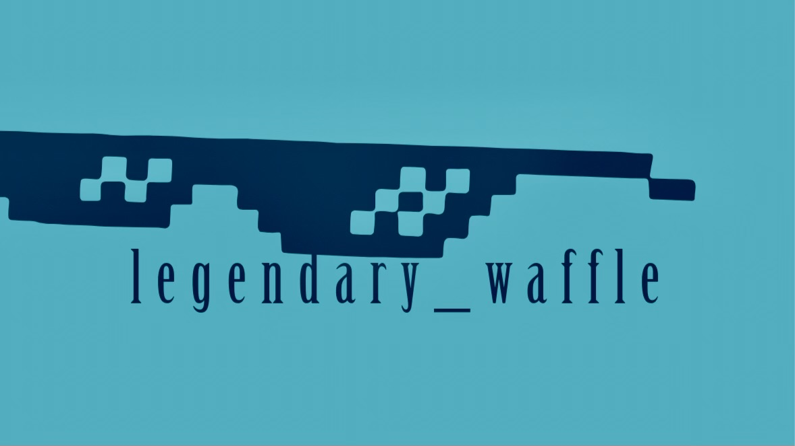

# 

**LEGENDARY_WAFFLE** - Кросплатформенный межсетевой экран для серверного оборудования/фаервол

## Идеи

За базовый минимум взять проект OPNsense и достичь его уровня
Исполнение будет в виде TUI с графиками. После полноценной разработки TUI версии, будет выпущена GUI

## Цели

Цель, написать кросплатформенный межсетевой экран для серверного и домашнего оборудования

Конкуренты - OPNsense и pfSense

### Проблемы конкурентов

Проблемы OPNsense:
- Сложности при настройке некоторых функций
- Проблемы с обновлениями. Основные релизы выходят крайне редко
- Сложность настройки. OPNsense обладает широким спектром функций, что может создавать сложности при настройке для начинающих пользователей
- Не является кроссплатформенным, тк создан как отедельная ОС

Проблемы pfSense:
- Проблемы с производтельностью
- Сложность в освоении и настройке
- Отсутствие интуитивно понятного интерфейса для новичков
- Сложности с расширенными функциями. Системы обнаружения/предотвращения вторжений требуют тонкой настройки и сложны в администрировании
- Проблемы с фильтрацией на уровне приложений (Layer 7)

### Сильные стороны конкурентов 

Сильные стороны OPNsense:
- Открытый исходный код
- Богатый набор функций
    - Межсетевой экран с контролем состояния соединений 
    - Система обнаружения и предотвращения вторжений (IDS/IPS) с использованием правил Suricata и Emerging Threats
    - Поддержка VPN (IPsec, OpenVPN, WireGuard, Tinc) для удаленного доступа
    - Многоканальный доступ в Интернет с балансировкой нагрузки и авто переключением при сбоях
    - Управление трафиком и веб-фильтрация
    - Кэширующий прокси-сервер и Captive Portal
    - Двухфакторная аутентификация
- Модульная архитектура с гибкой поддрежкой сторонних плагинов
- Активное сообщество и документация

Сильные стороны pfSense
- Проверен временем 
- Богатый функционал корпоративного уровня:
    - Межсетевой экран с контролем состояния соединений и возможность работы с VLAN
    - Поддержка VPN (IPsec, OpenVPN, WireGuard) для удаленного доступа 
    - Высокая доступность с использованием CARP для создания отказоустойчивых кластеров
    - Балансировка нагрузки и многоканальный доступ
    - Система обнаружения/предотвращения вторжений (IDS/IPS) с использованием правил Suricata 
    - DHCP/DNS-серверы и другие сетевые службы
- Открытый исходный код (Community Edition)
- Огромное сообщество и документация

### Базовый минимум LEGENDARY_WAFFLE

- Основа проекта и архитектур

    - Полностью открытый исходный кода
    - Возможнность запустить на любом(почти) оборудовании 
    - Модульная архитектура с гибкой настройкой 

- Сетевая безопасность и управление

    - Межсетевой экран с контролем состояния соединений 
    - Система обнаружения/предотвращения вторжений (IDS/IPS)
    - Возможно поддержка VPN для удаленного доступа
    - Фильтрация и управление трафиком

- Надежность и доступность

    - Многоканальный доступ в Интернет (Multi-WAN)
    - Балансировка нагрузки и автоматическое переключение при сбое (Failover)

- Основные сетевые службы

    - Удобное логирование логирование 
    - DHCP/DNS-серверы для авто настройки сети и локал разрешений доменных имен с кэшированием
    - Поддержка VLAN 802.1Q. Логическая сегментация сети для изоляции различных групп устройств 

- Управление и мониторинг

    - Удобное логирование и мониторинг в реальном времени
    - В качестве интерфейска TUI

### Необходимое для написания всех функций  

- Балансировка нагрузки / Multi-WAN. subprocess, мониторинг состояния сети через scapy или ping.
Выполнение команд ОС для изменения таблиц маршрутизации (ip route, route delete/add).	

- DHCP/DNS-серверы	(Работа с файлами, перезапуск системных служб.)
Управление конфигурационными файлами системных служб (например, dnsmasq, unbound).

- IDS/IPS (Suricata/Snort)	Запуск демона Suricata и чтение его логов, управление конфигурационными файлами.	subprocess, работа с файлами и сокетами.

### Дзайн

Минимализм и простота 

## Авторы & Разработчики

@StanislavBTC - Ядро 

@TheTerryWard - графика