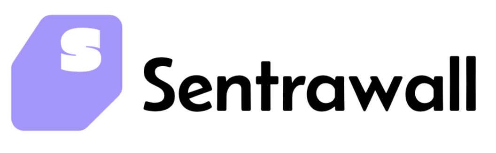
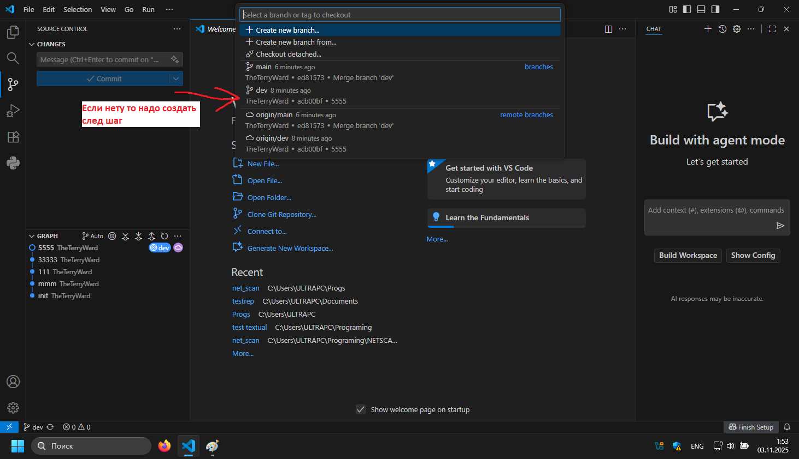
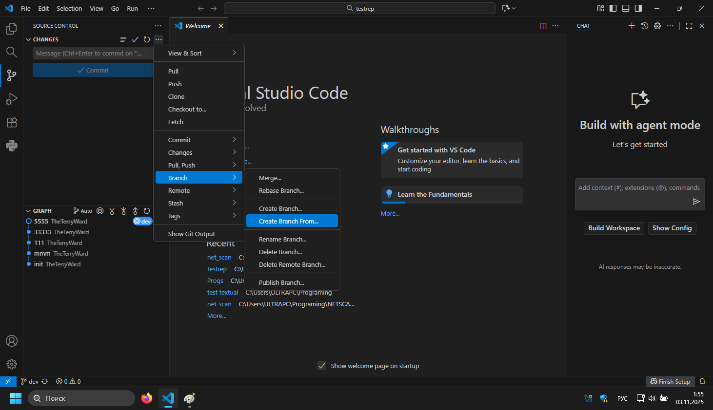
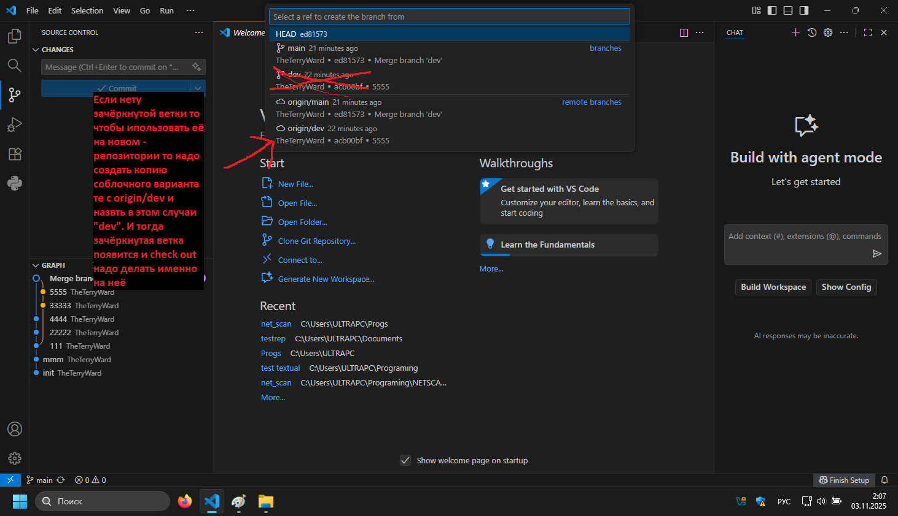
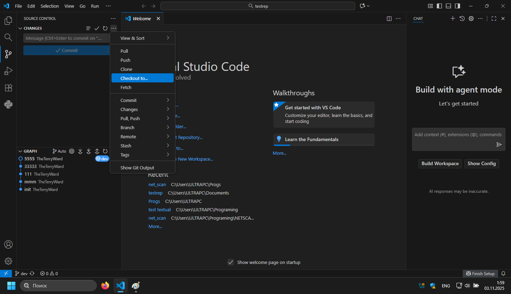
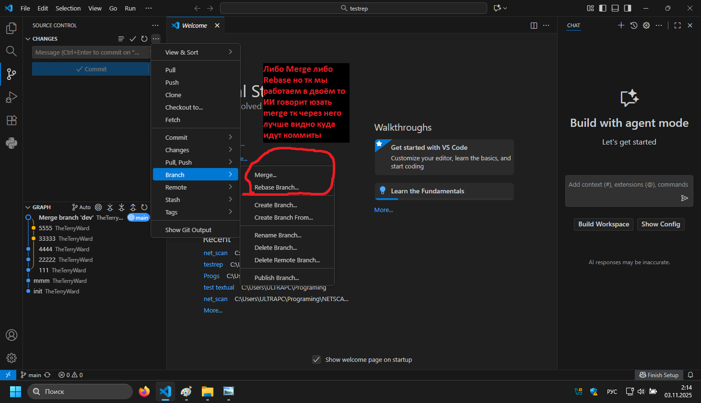

# 

SentraWall - Кросплатформенный межсетевой экран для серверного оборудования

## Идеи
за основу sniffnet (не обязательно)
https://github.com/GyulyVGC/sniffnet?tab=readme-ov-file

добавить кнопку блока пакета(ов) (серверов и тд)

добавить карту серверов (litle snitch)

AdBlock

DNS Over Https

### Дзайн

Кнопки скруглённые 
Цвета см в color_palette

Pipe — это пара взаимосвязанных концов канала связи между двумя процессами. В Python он реализован как два объекта Connection, полученных парой вызовов Pipe().
    •    По умолчанию Pipe() создаёт двунаправленное соединение (duplex=True), то есть оба конца можно использовать для отправки и получения сообщений. Можно сделать однонаправленное соединение (duplex=False) при необходимости ограничить направление передачи данных.
    •    Сообщения передаются как picklable объекты. Это значит, любой объект Python, который можно сериализовать через pickle, можно пересылать через Pipe.

Один процесс создаёт Pipe() и получает два конца соединения: conn1 и conn2.
    •    Обычно один из концов остаётся в “родительском” процессе, второй передаётся в дочерний процесс (или в GUI-процесс).
    •    Обмен данными идёт через методы send() и recv(). Модели с событиями можно расширить с помощью poll() для проверки наличия данных без блокировки.
    •    Закрывать соединение и корректно завершать оба конца важно для освобождения ресурсов и корректного завершения процессов.

---
# Инструкция по git 
Создание веток Ветки -> Создать ветку -> Создавать Коммиты
---
### Использование
---
1. Переходим в нужную ветку:

2. Переходим в локальную НЕ origin (если есть то преходим к пункту № .Если нет у то создаём локальную копию следуйщий шаг)

3. Создание копии:

4. Если нету локальной ветки(создали не с этого компютера-тк после git clone и тд копия не создаётся сама)

5. После создания, check out на локальную версию которую только что создали

6. Работаем. И для слияния с основной веткой коммитим все изменения и переходим в Main

7. Я посмотрел лучше всего merge тк rebase для фиксов

---
